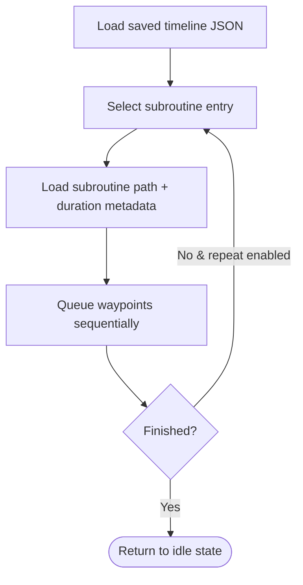
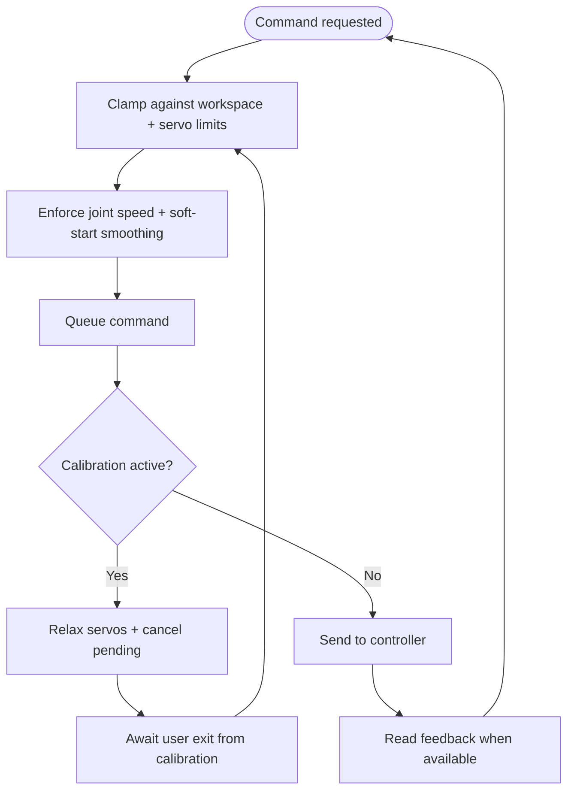
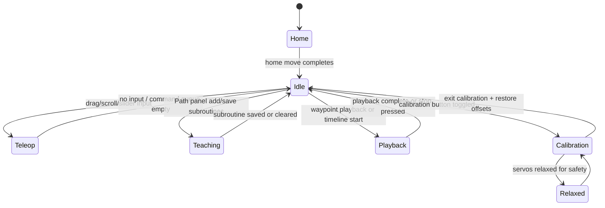
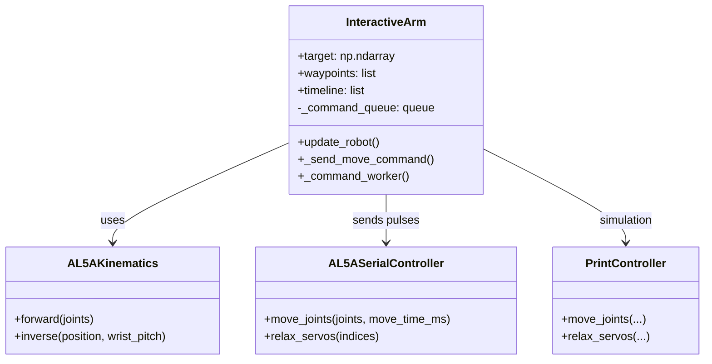

# Lynxmotion AL5A Software Documentation

This document summarises the existing codebase, how the modules collaborate, and the operational flows requested in the project brief. Diagrams use Mermaid syntax for readability.

## Software Architecture Diagram
```mermaid
flowchart LR
    User[(Operator)] --> CLI[CLI launcher (__main__.py)]
    CLI --> Interactive[InteractiveArm UI (interactive.py)]
    Interactive -->|inverse/forward kinematics| Kinematics[AL5AKinematics (al5a_kinematics.py)]
    Interactive -->|move_joints & relax_servos| Controllers[AL5ASerialController / PrintController (serial_comm.py)]
    Controllers -->|SSC-32 command bytes| Hardware[SSC-32/SSC-32U + servos]
    Interactive -->|calibration, waypoints, timeline| LocalFiles[~/.config/lynxmotion_al5a/*.json]
    Tests -->|fixtures & behaviours| Interactive
    Tests --> Kinematics
```

## Flowcharts

### Teleoperation
```mermaid
flowchart TD
    start([Start UI]) --> setpoint[Default home pose]
    setpoint --> input{User input?}
    input -->|Drag gizmo / scroll / sliders| target[Clamp target to workspace]
    input -->|Keyboard modifiers| target
    target --> ik[Inverse kinematics (wrist pitch + XYZ)]
    ik --> queue[Queue smoothed joint command]
    queue --> worker[Command worker thread]
    worker --> controller[move_joints to SSC-32 or simulator]
    controller --> feedback[Optional joint feedback -> visuals]
    feedback --> input
```

### Teach mode (waypoints/subroutines)
```mermaid
flowchart TD
    start([Enter Path panel]) --> record[Adjust pose + wrist]
    record --> addWaypoint[Add waypoint (position, duration, wrist pitch)]
    addWaypoint --> repeat{More waypoints?}
    repeat -->|Yes| record
    repeat -->|No| save[Save subroutine JSON]
    save --> playback[Play waypoints locally or add to timeline]
```

### Autoplay (timeline)


### Safety & calibration


## State Machine Diagram


## Pseudocode / Class Diagram

### Class overview


### Command path pseudocode
```
User adjusts target (drag, scroll, sliders)
    -> clamp to workspace and enforce wrist limits
    -> compute joints = kinematics.inverse(target, wrist_pitch)
    -> _send_move_command(joints, move_time_ms, soft_start)
        -> store setpoint + update visuals
        -> push (raw_joints, move_time, soft_start) to _command_queue
    -> _command_worker thread pops commands
        -> _generate_smooth_segments for soft start
        -> controller.move_joints(segment)
        -> mirror commanded joints into UI and optional feedback
```

## Inline Code Documentation

Recent updates add clarifying docstrings around the main entrypoint and critical control paths (queue management and smoothing) inside `InteractiveArm`. The class-level description now explains ownership of UI elements, calibration data, and threading, while helper methods document how commands flow from user input into the controller.

## Full Code Listing

See [`full_code_listing.md`](./full_code_listing.md) for the complete, current source for all Python modules and tests.
